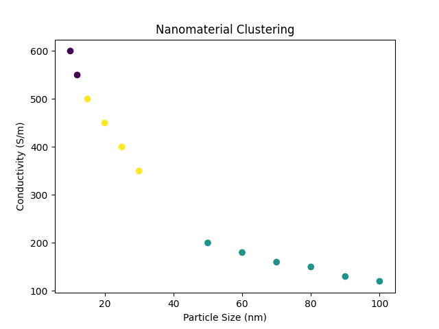

# Unsupervised Machine Learning for Nanomaterial Analysis

## Project Overview
Machine learning-based analysis of nanomaterial properties using clustering and dimensionality reduction techniques.

## Methods
- Data preprocessing and normalization (StandardScaler)
- K-Means clustering
- Principal Component Analysis (PCA) for dimensionality reduction
- Data visualization

## Results
- Identified clusters of nanomaterials with similar physical and electronic properties
- Observed relationship between particle size and conductivity
- Demonstrated data-driven classification approach for materials analysis

## Tools
Python, Pandas, Scikit-learn, Matplotlib

## Relevance
This project demonstrates:
- Scientific data analysis
- Machine learning in materials science
- Foundations for electron microscopy data interpretation

## Results Visualization

